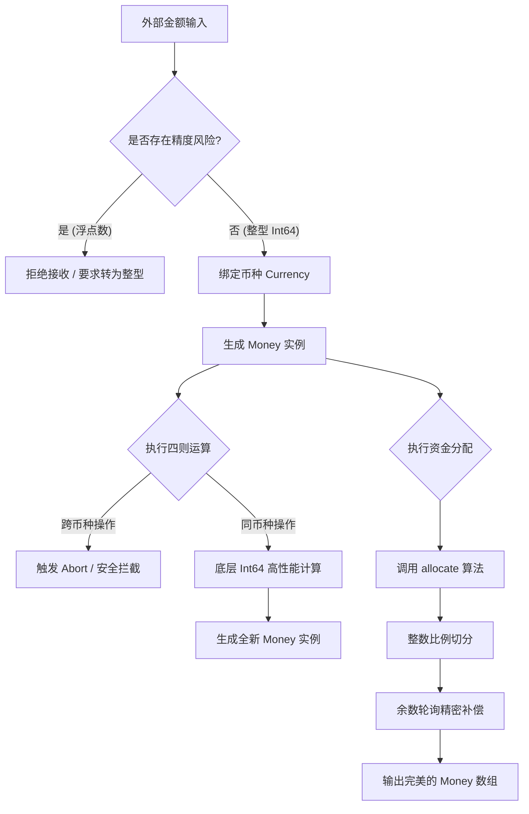

<div align="center">

# 🌕 MoonMoney

**专为 MoonBit 设计的轻量级、零依赖、高精度财务金额计算引擎。**

[](https://www.moonbitlang.com/)
[](LICENSE)
[](https://github.com/wju-yuki111/Moonbit_project/actions)

</div>

---

MoonMoney 是一个极其严谨的金额处理库。在商业交易系统（如电商、支付、金融结算）中，直接使用普通的浮点数处理金钱极易引发精度灾难（比如 `0.1 + 0.2 = 0.30000000000000004`）。
本项目基于 `Int64` 打造了绝对无损的核心引擎，并在编译器层面严格隔离不同币种的运算，确保您的业务代码永远不会因为类型错误或精度丢失而造成资金损失！

## ✨ 核心特性

- **彻底杜绝精度误差**: 底层全部使用 `Int64` 存储分、厘等最小货币单位，切断浮点运算误差。
- **跨币种安全隔离**: 编译器级别防止错误地将“美元”和“人民币”直接相加，触发跨币种运算时提供极速拦截。
- **智能无损分配算法 (Smart Allocation)**: 本项目最具价值的亮点。能够将一笔钱按任意比例完美拆分，绝不会丢失一分钱的除法余数。
- **纯血 MoonBit**: 0 外部依赖，完美实现了 `Eq`, `Compare`, `Show` 等原生 Traits，开箱即用。

## 🏛️ 核心架构

MoonMoney 的运算链路经过了严格的安全设计，其底层处理逻辑如下：



## 📦 极速安装

在您的 MoonBit 项目中，通过标准的 `moon` 包管理器安装：

```bash
moon add zfmLink/moon-money
```

## 🚀 最佳实践与场景演示

### 1. 基础金额创建
在电商系统中，我们通常用最小单位（如美分）来初始化商品价格。

```moonbit
// 创建一笔 10 美金的金额 (1000 美分)
let price = Money::new(1000L, usd) 
// 创建一笔 1.5 美金的税费
let tax = Money::new(150L, usd)    
```

### 2. 绝对安全的财务数学运算
MoonMoney 保证您不会在无意间犯下致命的财务逻辑错误。

```moonbit
let total = price.add(tax)
println(total) // 输出: "USD 1150"

// ❌ 灾难拦截：尝试将美元和人民币相加会直接 abort
// let invalid = price.add(Money::new(100L, cny)) 
```

### 3. 【杀手级功能】智能无损分配算法
假设有 100 块钱，需要平分给 3 个合伙人。如果直接除以 3，每人得 33.33，加起来是 99.99，**那丢失的 1 分钱去哪了？在财务审计中这是绝对不被允许的**。
调用我们的 `allocate` 算法即可完美解决：

```moonbit
let fund = Money::new(100L, cny) // 100 分钱
let shares = fund.allocate([1, 1, 1]) // 1:1:1 比例平分

// 算法会自动将余下的 1 分钱补给前列，一分不差！
println(shares[0]) // CNY 34
println(shares[1]) // CNY 33
println(shares[2]) // CNY 33
```

## 🤝 参与贡献
我们非常欢迎任何对高精度计算感兴趣的 MoonBit 开发者提交 PR 和 Issues。请阅读 `CONTRIBUTING.md` 了解更多关于本地开发和测试的信息。

## 📝 许可协议
本项目基于 [MIT License](LICENSE) 开源，您可以自由地将其应用于任何商业场景。